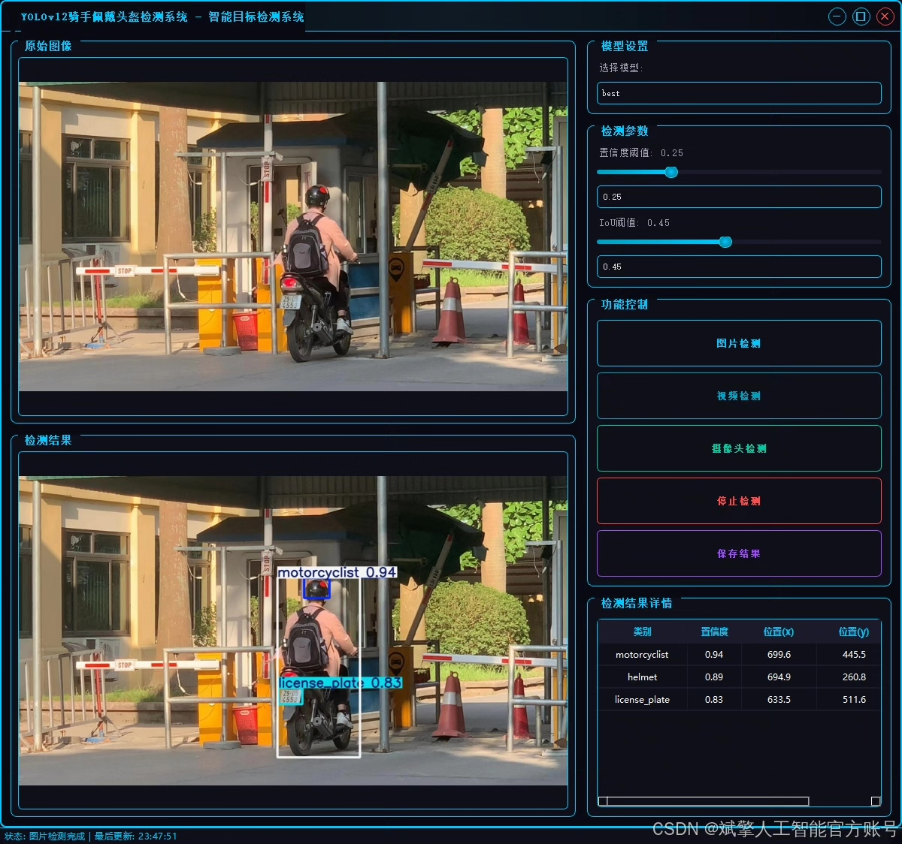
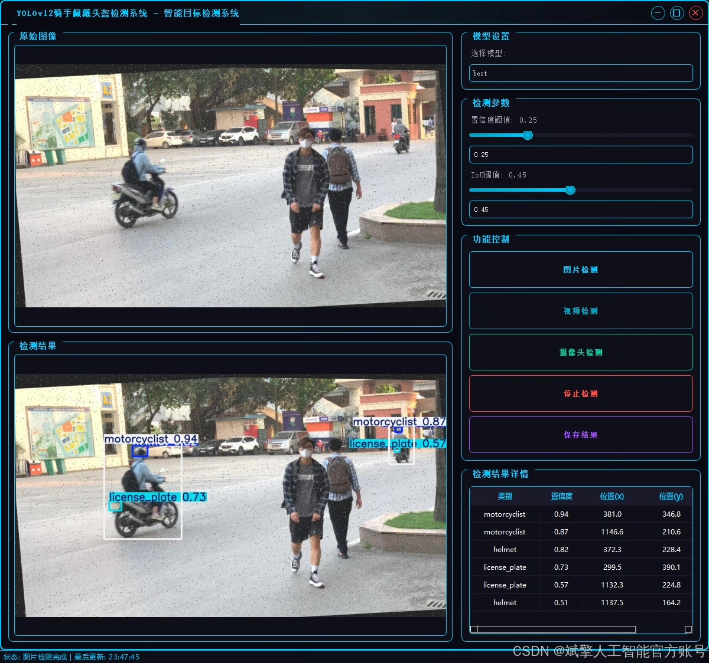
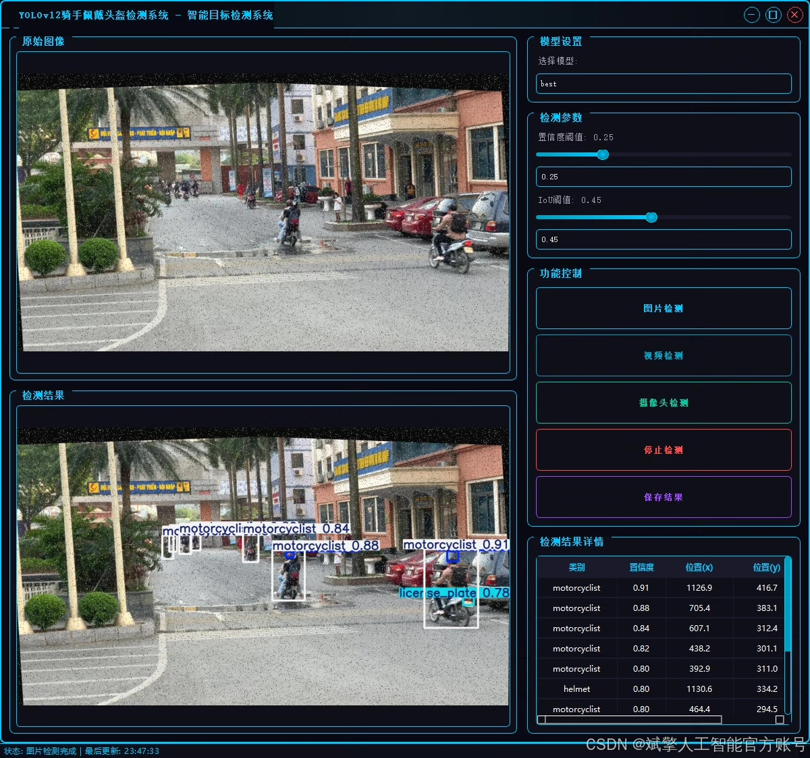
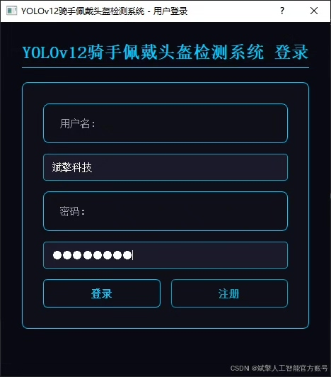
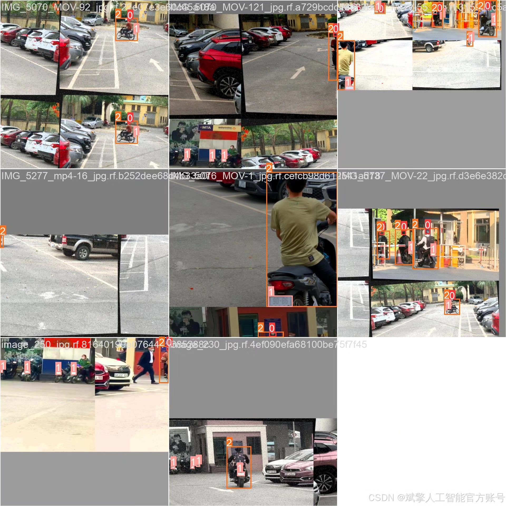
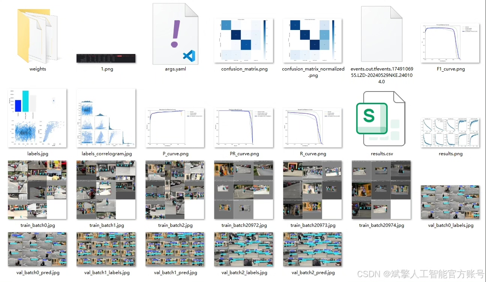
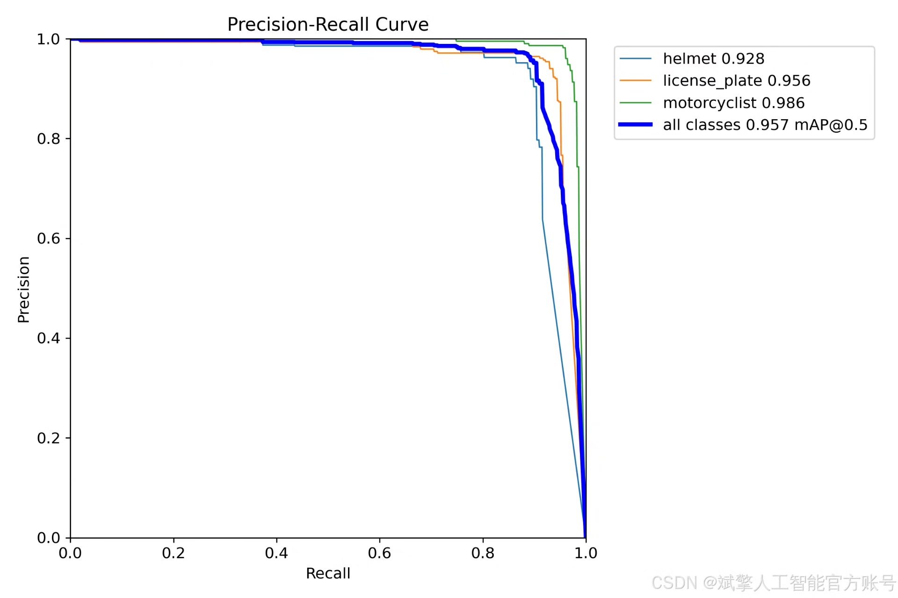
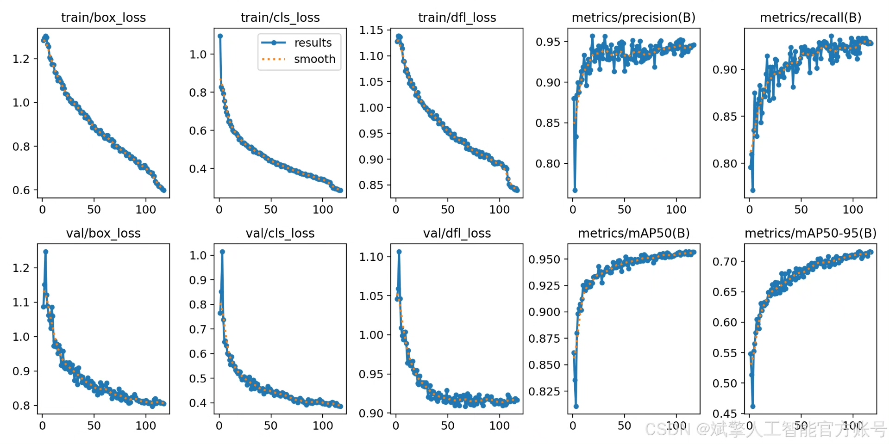
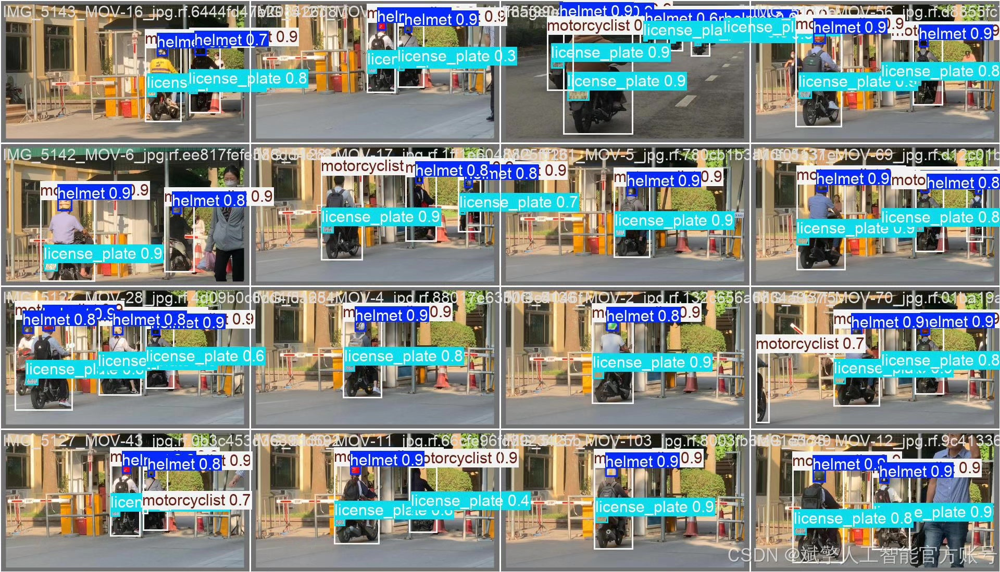

# YOLOv12 helmet detection system

## Body

YOLOv12 Helmet Detection System Based on Deep Learning YOLOv12: A Rider Helmet Detection System (YOLOv12+YOLO Dataset + UI Interface + Login and Registration Interface + Python Project Source Code + Model)

This article introduces a rider helmet detection system based on the advanced object detection model YOLOv12. The system aims to perform real-time, accurate detection and recognition of motorcycle riders in traffic scenarios, with core functions including: detecting motorcycle riders (motorcyclist), determining whether they are wearing helmets as required (helmet), and simultaneously recognizing their vehicle license plate (license_plate). The system detects three target categories and has been thoroughly trained and validated on its own dataset. Experimental results show that the system can effectively handle complex road environments, possesses high accuracy and good robustness, and can be widely applied in traffic law enforcement, smart city management, and safety monitoring fields, providing strong technical support for improving road traffic safety levels.

✅ User Login and Registration: Supports password verification and security validation.
✅ Three Detection Modes: Based on the YOLOv12 model, supports image, video, and real-time camera detection, accurately identifying targets.
✅ Dual Screen Comparison: Displays the original scene and detection results on the same screen.
✅ Data Visualization: Real-time table displaying the category, confidence, and coordinates of detected targets.
✅ Intelligent Parameter Tuning: Offers a confidence slide bar, dynamically optimizing detection accuracy to meet different scene needs.
✅ Sci-Fi Style Interactive Interface: Dark theme paired with dynamic light effects, reducing visual fatigue and enhancing operational experience.

## Images

## Payment

Here is a pay link on Stripe ( https://buy.stripe.com/3cs8yP7sY87d0vu9AB ). Please contact me lonlonago@foxmail.com after funding $89, and I will send you a complete data files , thank you!

